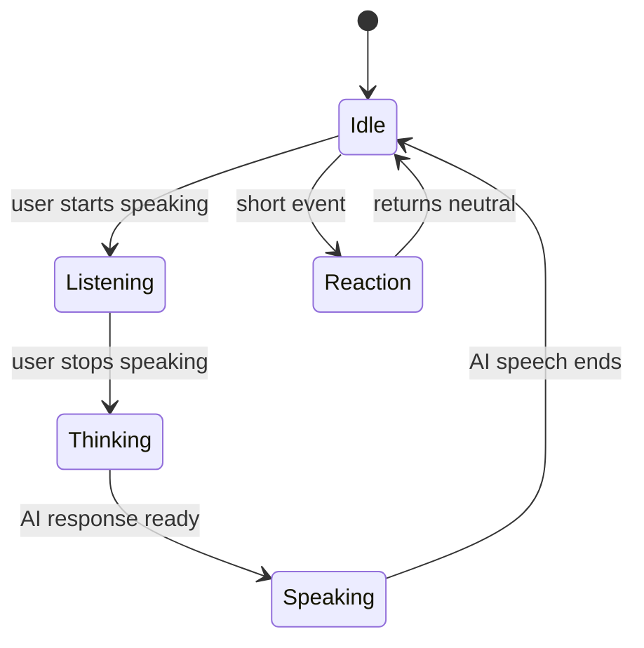

# AI Video Companion Pose Transition Plan

## Goal

Build a more realistic AI video-call avatar system where a character can move through small, natural poses while still transitioning smoothly back to a single default resting position.

The current system uses one looping idle video and applies live lipsync through WebRTC/MuseTalk. The next improvement is to support a small library of gesture and reaction clips such as nodding, smiling, thinking, listening, and slight head tilts.

The core constraint is:

```txt
Every gesture clip must start and end at the exact same canonical resting pose.
```

This allows clips to be stitched together during a live call without visible jumps.

## Current Baseline

The current default frame is a centered talking-head composition:

- Subject faces camera directly.
- Shoulders are visible.
- Background is static and softly blurred.
- Expression is neutral and calm.
- Hair and clothing occupy a large part of the lower frame.
- The avatar currently has minimal motion beyond lipsync.

This should become the canonical neutral anchor for all motion.

## Key Idea

Do not create independent pose videos and hope they align.

Instead, every clip should follow this structure:

```txt
canonical neutral hold -> gesture/action -> return to canonical neutral -> canonical neutral hold
```

For example:

```txt
neutral -> slight nod -> neutral
neutral -> glance down thinking -> neutral
neutral -> warm smile -> neutral
neutral -> empathetic head tilt -> neutral
```

The first and last usable frames of every clip should either be the exact same neutral frame or rendered from the exact same tracked neutral parameters.

## Recommended Initial Pose Bank

Start small. The first production version should use 6 to 8 clips, not dozens.

| Clip | Purpose | Lipsync? | Notes |
|---|---:|---:|---|
| `idle_neutral` | Default loop | Optional | Main resting state, blink and tiny breathing only. |
| `listen_warm` | User is speaking | No | Slight forward attention, softer eyes, tiny smile. |
| `think_down_glance` | AI is processing | No | Eyes glance down or slightly away, then return. |
| `speak_neutral` | AI is speaking | Yes | Main MuseTalk/lipsync clip. Keep stable. |
| `nod_agree` | Backchannel | No | Short nod for "yeah", "I see", "mm-hmm". |
| `smile_react` | Positive reaction | Optional | Short smile, then return to neutral. |
| `empathetic_tilt` | Supportive response | Optional | Small head tilt, soft expression. |
| `curious_brow` | Question/surprise | Optional | Slight eyebrow raise or curious look. |

Avoid large body shifts, big head turns, hand gestures, or dramatic camera changes in the first version. MuseTalk/lipsync will be more stable when face scale, crop, lighting, and mouth region remain close to the neutral clip.

## Runtime Behavior Model

The avatar should not choose clips randomly. It should behave according to conversation state.

| Conversation State | Avatar Behavior |
|---|---|
| User is speaking | Use `listen_warm`, occasional `nod_agree`, subtle blink/breathing. |
| User stops speaking | Use `think_down_glance` or a brief neutral pause. |
| AI starts responding | Return to neutral, then use `speak_neutral` with lipsync. |
| AI is emotionally supportive | Use `empathetic_tilt` before or after speech. |
| AI says something friendly/funny | Use `smile_react` or short amused reaction. |
| Long silence | Use subtle idle, blink, tiny glance away and back. |

The perceived realism comes from turn-taking:

```txt
listen -> think -> speak -> settle -> listen
```

This is more important than having many expressive poses.

## Clip Metadata

Each clip should have metadata that lets the runtime know when and how it can be used.

```ts
type PoseClip = {
  id: string;
  mode: "idle" | "listening" | "thinking" | "speaking" | "reaction" | "transition";
  emotion: "neutral" | "warm" | "empathetic" | "amused" | "curious";
  canLipSync: boolean;
  durationMs: number;
  intensity: 0 | 1 | 2 | 3;
  startsAtNeutral: boolean;
  endsAtNeutral: boolean;
  safeSwitchFrames: number[];
};
```

The runtime should only switch clips on safe frames, ideally during neutral holds.

Safe frames usually have:

- Mouth closed.
- Low head motion.
- Neutral or near-neutral expression.
- Eyes near camera.
- Face center aligned to canonical neutral.
- Shoulders aligned to canonical neutral.

## Phone Recording Workflow

If recording yourself manually on a phone, treat the recording as motion reference, not as a perfect final aligned asset.

Manual recording is useful for natural timing and believable human motion, but it is not reliable for exact endpoints.

### Capture Setup

Use the same setup for every take:

- Phone on tripod.
- Locked exposure, focus, and white balance.
- Same lens and focal length.
- Same distance from camera.
- Same seat/chair position.
- Same lighting.
- Same background if the footage itself is used.
- Record in 4K if possible, then crop/stabilize down.
- Use a face/shoulder guide overlay if available.

### Take Pattern

Every recording should follow this pattern:

```txt
2 seconds neutral hold
gesture/action
return as close as possible to neutral
2 seconds neutral hold
```

Example:

```txt
neutral hold -> nod -> neutral hold
neutral hold -> smile -> neutral hold
neutral hold -> look down thinking -> neutral hold
neutral hold -> head tilt empathy -> neutral hold
```

The final asset should not rely on the recorded final neutral being perfect. The recorded final neutral is only a guide.

## DaVinci Resolve / Fusion Workflow

DaVinci Resolve can be used for the MVP asset workflow. Fusion includes tracking, planar tracking, match move, and stabilization features that can help align clips to a reference frame. See Blackmagic's official [Fusion overview](https://www.blackmagicdesign.com/products/davinciresolve/fusion) and [Resolve Fusion visual effects guide](https://documents.blackmagicdesign.com/UserManuals/DaVinci-Resolve-18-Fusion-Visual-Effects.pdf).

### Resolve Editing Structure

For each gesture clip:

```txt
exact neutral freeze frame
-> stabilized gesture footage
-> animated correction back to neutral
-> exact neutral freeze frame
```

### Practical Fusion Steps

1. Create a canonical neutral still.
   - Export the exact resting frame from the current default video.
   - This becomes the reference for all clips.

2. Import the phone gesture clip.
   - Use takes that include neutral holds at beginning and end.

3. Overlay the neutral reference.
   - Put the neutral still above the clip.
   - Use low opacity or difference/comparison blending to see mismatch.

4. Stabilize the face/body.
   - Track stable points such as eyes, nose bridge, mouth corners, and shoulders.
   - Use Fusion tracker, planar tracker, or transform keyframes to reduce accidental drift.

5. Align the gesture to the neutral anchor.
   - Keyframe position, scale, and rotation.
   - The face center, eye line, and shoulder line should match the canonical neutral at start and end.

6. Return to neutral.
   - Animate the correction back to the neutral frame over 12 to 24 frames.
   - Use easing so the return does not feel mechanical.

7. End with the literal neutral still.
   - The final 8 to 15 frames should be the exact canonical neutral frame.
   - Do not end on a merely close recorded frame.

8. Export the clip.
   - Keep resolution, FPS, color profile, and crop consistent across all pose clips.

## Important Editing Rule

The final frame of a gesture clip should not be "close enough."

It should be one of:

1. The exact canonical neutral still.
2. A frame generated from the exact same avatar parameters as canonical neutral.
3. A validated frame whose face/body landmarks match the canonical neutral within strict thresholds.

For the MVP, use option 1.

## Automated Validation

After exporting clips, add an automated validation step in the repository. This should check whether each pose clip starts and ends near the canonical neutral.

Use face landmarks and simple image checks.

Potential tools:

- MediaPipe Face Mesh.
- OpenCV.
- A face alignment model.
- Optional shoulder/body pose model.

### Suggested Checks

For each exported clip:

| Check | Target |
|---|---:|
| Face center delta | Less than 2 px to 4 px from neutral. |
| Eye distance scale delta | Less than 1 percent. |
| Head yaw/pitch/roll | Less than 1 to 2 degrees from neutral. |
| Mouth openness | Near neutral/closed. |
| Eye gaze | Near camera or neutral reference. |
| Shoulder line | Near neutral if visible. |
| Background/crop | Same dimensions and framing. |
| First frame | Matches neutral or accepted threshold. |
| Last frame | Matches neutral or accepted threshold. |

Validation output should mark clips as:

```txt
PASS
WARN
FAIL
```

Any failed clip should not be used in production.

## Runtime Switching Rules

The runtime should avoid arbitrary hard cuts.

Recommended switching policy:

```txt
Only switch from one non-speaking gesture to another after the current clip reaches a neutral hold.
```

Basic state machine:



The speaking state should be especially conservative. Keep the head pose stable during MuseTalk/lipsync unless the pipeline is proven to handle pose changes cleanly.

## Suggested Asset Format

Keep all pose clips consistent:

| Property | Recommendation |
|---|---|
| Resolution | Same as current WebRTC stream target. |
| FPS | Same for all clips, preferably 25, 30, or 50/60 depending on current pipeline. |
| Codec | H.264/H.265 for delivery, ProRes/DNxHR for intermediate editing. |
| Duration | 1 to 4 seconds for gestures, longer for idle loops. |
| First frames | 8 to 15 frames of exact neutral. |
| Last frames | 8 to 15 frames of exact neutral. |
| Background | Locked and consistent. |
| Lighting | Locked and consistent. |
| Crop | Identical across all clips. |

## Proposed Repository Structure

This can be adjusted to match the existing codebase.

```txt
assets/
  avatars/
    avatar_001/
      neutral/
        neutral.png
        idle_neutral.mp4
      poses/
        listen_warm.mp4
        think_down_glance.mp4
        speak_neutral.mp4
        nod_agree.mp4
        smile_react.mp4
      pose_manifest.json
      validation_report.json

scripts/
  validate_pose_clips.py
  extract_neutral_frame.py
  generate_pose_manifest.py
```

Example manifest:

```json
{
  "avatarId": "avatar_001",
  "neutralFrame": "neutral/neutral.png",
  "clips": [
    {
      "id": "idle_neutral",
      "path": "neutral/idle_neutral.mp4",
      "mode": "idle",
      "emotion": "neutral",
      "canLipSync": false,
      "startsAtNeutral": true,
      "endsAtNeutral": true,
      "safeSwitchFrames": [0, 1, 2, 3, 4, 5]
    },
    {
      "id": "speak_neutral",
      "path": "poses/speak_neutral.mp4",
      "mode": "speaking",
      "emotion": "neutral",
      "canLipSync": true,
      "startsAtNeutral": true,
      "endsAtNeutral": true,
      "safeSwitchFrames": [0, 1, 2, 3, 4, 5]
    }
  ]
}
```

## Open Questions For Codebase Validation

Codex should inspect the current MuseTalk/WebRTC implementation and answer these questions:

1. Where does the current idle loop enter the WebRTC video pipeline?
2. Is the idle loop decoded once and reused, or decoded continuously?
3. Can the pipeline swap video sources at runtime without renegotiating WebRTC?
4. Does MuseTalk require a fixed source video for lipsync, or can it accept pose clips dynamically?
5. Is lipsync generated from the whole clip, a frame buffer, or a live frame stream?
6. Can the system detect when the AI is listening, thinking, and speaking?
7. Is there already an event bus/state machine for conversation state?
8. What is the current latency budget for switching visual states?
9. Can pose transitions happen client-side, server-side, or both?
10. Is there a risk that switching base videos breaks face identity consistency?
11. Are generated lipsync frames composited over source frames, or does MuseTalk regenerate full frames?
12. What frame format and FPS does the current pipeline expect?
13. Can a pose manifest be loaded per character?
14. Where should pose validation run: offline asset build step, server startup, CI, or admin upload?

## Likely Gaps / Risks

These are the areas most likely to need engineering work.

| Risk | Why It Matters | Mitigation |
|---|---|---|
| Pose clips do not align perfectly | Causes visible jump cuts. | Use canonical neutral frame, validation, and neutral holds. |
| MuseTalk performs poorly on changing head pose | Lipsync may drift or distort. | Keep speaking mostly in `speak_neutral`. Use gestures between turns. |
| Runtime source switching causes WebRTC jitter | Users may see freezes or dropped frames. | Preload clips, switch on neutral frames, avoid renegotiation. |
| Too many gestures feel unnatural | Avatar may look twitchy. | Use low-frequency scheduler and state-based behavior. |
| Phone footage has lighting/crop mismatch | Breaks identity realism. | Lock capture setup and use post alignment. |
| Manual editing does not scale | Hard to produce many characters. | Add automated validation and eventually rig/retarget pipeline. |
| Final neutral is only visually close | Clip still jumps on switch. | End with literal neutral still or generated exact neutral. |

## Recommended MVP Implementation

Phase 1 should prove that the runtime can switch among neutral-safe clips without breaking WebRTC or MuseTalk.

### Phase 1 Assets

Create only these clips first:

```txt
idle_neutral.mp4
speak_neutral.mp4
listen_warm.mp4
think_down_glance.mp4
nod_agree.mp4
smile_react.mp4
```

Each clip must:

- Start with exact neutral.
- End with exact neutral.
- Use the same resolution/FPS/crop.
- Be short and subtle.
- Pass validation before use.

### Phase 1 Runtime

Implement:

- Pose manifest loader.
- Pose state machine.
- Clip preloading/cache.
- Neutral-frame-only switching.
- Speaking state integration with MuseTalk.
- Fallback to `idle_neutral` if anything fails.

### Phase 1 Validation

Implement:

- Script to extract first and last frames.
- Script to compare them against canonical neutral.
- Basic OpenCV image diff.
- Optional MediaPipe face landmark alignment check.
- CI or manual command that rejects bad clips.

## Longer-Term Direction

The best long-term solution is not manual video editing for every character.

The scalable solution is:

```txt
record human motion reference
-> extract head pose / gaze / expression / timing
-> retarget motion to avatar
-> render from canonical avatar identity
-> force first and last frames to neutral parameters
-> validate landmarks
```

This turns phone recordings into reusable motion data instead of final pixels.

Eventually, each avatar should have:

- Canonical neutral identity.
- Controlled expression/pose parameters.
- Reusable gesture curves.
- Automated render/export.
- Automated validation.

## Codex Validation Prompt

Use this prompt in Codex after placing this file in the repository:

```txt
Read AI_VIDEO_COMPANION_POSE_TRANSITION_PLAN.md and inspect the current repository implementation.

Validate whether this pose-bank plan is compatible with the existing MuseTalk/WebRTC architecture.

Please answer:
1. Where should pose clip selection happen in the current codebase?
2. Can we swap pose clips without renegotiating WebRTC?
3. Does the current MuseTalk integration support dynamic source clips, or does it assume one fixed idle video?
4. What code changes would be needed for a pose manifest and state machine?
5. What are the highest-risk assumptions in this plan?
6. What is the smallest MVP implementation path?
7. What validation script should be added first?

Do not implement yet. First produce a technical feasibility review with file references.
```

## Final Recommendation

For the current app, use DaVinci Resolve/Fusion for the first MVP clips, but enforce a strict neutral-anchor rule:

```txt
Every clip starts at the exact neutral frame.
Every clip returns to the exact neutral frame.
The runtime only switches during neutral holds.
The speaking clip stays conservative and stable.
Validation rejects clips that do not align.
```

This should produce a much more realistic AI video-call companion without requiring a full avatar rig on day one.
